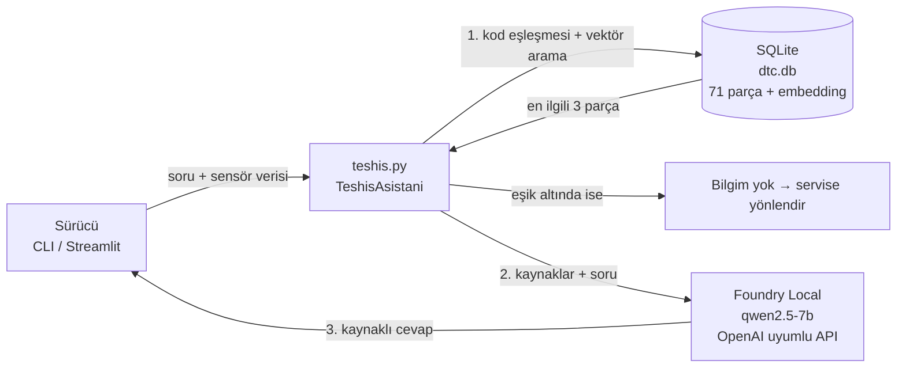

# 🔧 Yerel Araç Arıza Teşhis Asistanı

**Microsoft Foundry Local + RAG ile, internet bağlantısı olmadan çalışan Türkçe araç arıza teşhis asistanı**

*Microsoft Türkiye Yaz Okulu 2026 — "Building Your First Local RAG Application with Foundry Local" projesi*

Sürücü bir OBD-II arıza kodu (ör. `P0301`) veya bir belirti (ör. *"hararet yükseldi, kaputtan buhar geliyor"*) yazar. İsterse canlı sensör verisi de ekler. Asistan yerel bilgi tabanında ilgili bilgiyi bulur, Foundry Local üzerinde çalışan yerel LLM ile kaynak göstererek adım adım Türkçe tavsiye üretir. Bilgi tabanında cevap yoksa uydurmaz, servise yönlendirir.

## Neden bu proje?

Proje başında modelleri RAG olmadan denedim ([deneyler/ragsiz_model_karsilastirma.json](deneyler/ragsiz_model_karsilastirma.json)):

- **phi-3.5-mini**, Türkçe soruda "motorun motorun motorun…" diye binlerce karakter aynı kelimeyi tekrarladı.
- **qwen2.5-1.5b**, P0420'yi "bilgisayar bağlantı kesimi" diye açıkladı. Doğrusu katalitik konvertör verimi.

Küçük yerel modeller alan bilgisini ezberden veremiyor ve kendinden emin şekilde uyduruyor. Araç arızasında yanlış tavsiye tehlikeli olabilir. Bu yüzden cevaplar doğrulanmış bir bilgi tabanına dayanmalı. RAG tam olarak bunu sağlıyor.

## Mimari



| Katman | Kullanılan |
|---|---|
| Arayüz | `sohbet.py` (komut satırı), `web.py` (Streamlit) |
| Pipeline | `teshis.py`: arama, red kararı, prompt oluşturma, LLM çağrısı |
| Veri | `bilgi_tabani.py`: parçalama, embedding, SQLite |
| Embedding | `intfloat/multilingual-e5-base` (sentence-transformers, yerelde) |
| LLM | Microsoft Foundry Local: `qwen2.5-7b-instruct` (Apple Silicon GPU varyantı) |

### Bilgi tabanı (`veri/`)
- `dtc_kodlari.json`: 37 OBD-II arıza kodu (P, C, B, U). Her kod açıklama, olası sebepler, öneriler ve aciliyet seviyesi içerir. Her kod tek bir parçadır.
- `belgeler/*.md`: Gösterge ışıkları, OBD-II temelleri, acil durumlar ve periyodik bakım rehberleri. Önce `##` başlıklarına, uzun bölümler de en fazla 400 karakterlik cümle gruplarına bölünür. Her parçaya bölüm başlığı eklenir.

### Tasarım kararları
1. **Hibrit arama:** Embedding modelleri `P0301` ile `P0302` gibi kodları güvenilir ayırt edemiyor. Sorgudaki arıza kodları önce SQLite'ta birebir aranıyor, kalan yer anlamsal aramayla dolduruluyor.
2. **Red kararı modele bırakılmıyor:** En iyi parça bile benzerlik eşiğinin altındaysa ya da sorulan kod bilgi tabanında yoksa LLM hiç çağrılmıyor. Küçük modeller "bilmiyorum" demek yerine uydurmaya meyilli.
3. **Kaynak gösterme:** Parçalar numaralı kaynak olarak veriliyor, modelden her bilgiye `[1]` gibi atıf yapması isteniyor. Arayüz de kullanılan kaynakları gösteriyor.
4. **Modelden bağımsız güvenlik katmanı:** Hararet, yağ basıncı, fren ve duman gibi hayati durumlar anahtar kelimeyle yakalanıyor. Bu durumlarda:
   - Rehberlerden alınmış sabit bir güvenlik uyarısı cevabın başına her zaman ekleniyor.
   - İlgili rehber bölümü, embedding sıralamasında geride kalsa bile kaynaklara zorla ekleniyor.
   - Modele de "bu durum acil" bilgisi veriliyor ki uyarıyla çelişmesin.
5. **Dil kayması koruması:** Qwen modelleri zaman zaman Çinceye kayabiliyor. Çince/Japonca/Korece karakter görülürse cevap, önceki son tam cümlede kesiliyor.
6. **Düşük sıcaklık (0.2):** Daha tutarlı, daha az yaratıcı (daha az uydurma) cevaplar için.

## Kurulum

Gereksinimler: Python 3.10+, [Foundry Local](https://learn.microsoft.com/azure/ai-foundry/foundry-local/get-started) (macOS: `brew install microsoft/foundrylocal/foundrylocal`, Windows: `winget install Microsoft.FoundryLocal`)

```bash
# 1. Sanal ortam ve paketler
python3 -m venv .venv
source .venv/bin/activate          # Windows: .venv\Scripts\activate
pip install -r requirements.txt

# 2. Foundry Local servisi ve model (ilk seferde indirilir, sonra offline)
foundry service start
foundry model run qwen2.5-7b       # modeli indirip yükler; açılan sohbetten /exit ile çıkabilirsiniz

# 3. Bilgi tabanını kur (embedding modeli ilk seferde indirilir)
python bilgi_tabani.py
```

> Düşük RAM'li bilgisayarlarda daha küçük model kullanılabilir (`CHAT_MODELI=qwen2.5-1.5b python sohbet.py`), ancak testlerde cevap kalitesi belirgin şekilde düştü (bkz. Sonuçlar).

## Kullanım

```bash
# Web arayüzü
streamlit run web.py

# Komut satırı
python sohbet.py
Soru> P0301 kodu var | RPM: 820 dalgalı, Motor sıcaklığı: 90°C
```

Tüm ayarlar (`CHAT_MODELI`, `EMBED_MODELI`, `KAC_PARCA`, `BENZERLIK_ESIGI`, `SICAKLIK`…) [ayarlar.py](ayarlar.py) içinde, ortam değişkeniyle değiştirilebilir.

## Test ve değerlendirme

[veri/test_sorulari.json](veri/test_sorulari.json) içinde 25 etiketli soru var: 5 arıza kodu, 9 belirti, 6 genel bilgi ve 5 cevaplanamaz soru (bilgi tabanında olmayan kod, konu dışı sorular).

```bash
python degerlendirme.py arama                          # sadece retrieval, LLM gerekmez
python degerlendirme.py uctan-uca --model qwen2.5-7b   # tam sistem
```

### Sonuçlar (13 Eylül 2026, Apple M1 16 GB)

**Arama:** 20 cevaplanabilir sorunun 19'unda doğru kaynak bulundu. Konu dışı 5 sorunun 5'i model çağrılmadan reddedildi. Embedding modeli ve eşik karşılaştırması: [sonuclar/embedding_karsilastirmasi.md](sonuclar/embedding_karsilastirmasi.md)

**Cevap kalitesi:** 20 cevaplanabilir sorunun cevaplarını elle puanladım ([sonuclar/elle_inceleme.md](sonuclar/elle_inceleme.md)).

| | qwen2.5-7b (varsayılan) | qwen2.5-1.5b |
|---|---|---|
| Doğru / Kısmen / Hatalı | **14 / 4 / 1** | 4 / 4 / 11 |
| Tehlikeli cevap | **0** | 3 |
| Kaynak numarası veren cevap | 13/19 | 0/19 |
| Soru başına ortalama süre | 17.2 sn | 7.6 sn |

Aynı retrieval ve aynı kaynaklarla 1.5B model sık sık tekrar döngüsüne giriyor ve ilgisiz kaynaklardan sonuç çıkarıyor. Bu yüzden varsayılan model 7B.

Detaylı tablolar: [sonuclar/](sonuclar/)

## Öğrendiklerim

- **RAG'ın değeri:** Aynı küçük model, RAG olmadan P0420'yi yanlış açıklarken, doğru kaynak verildiğinde doğru ve kaynaklı cevap veriyor.
- **Retrieval kalitesi her şeyden önce geliyor:** Model ne kadar iyi olursa olsun, yanlış parça gelirse cevap da yanlış oluyor. İlk embedding modeli "kaputtan **buhar** geliyor" sorusuna "**buhar**laşma emisyon sistemi" parçasını getirdi. Türkçe için daha güçlü bir modele (E5) geçmek belirleyici oldu.
- **Parçalama önemli:** Tek bölümde yağ, buji ve triger bilgisi birlikteyken "triger" sorusu bulunamıyordu. Cümle gruplarına bölünce bulundu.
- **Benzerlik eşiği modele özgü:** E5 skorları 0.75–0.90 arasına sıkıştığı için MiniLM'de işe yarayan 0.35 eşiği anlamsızdı. Eşiği test setiyle ölçerek seçtim.
- **"Bilmiyorum" demeyi kod garanti etmeli:** Prompt'ta "uydurma" demek yetmiyor. Güvenilir red kararı retrieval skoruna göre programda veriliyor.
- **Otomatik metrik yetmez, cevapları okumak gerekir:** Kaynak doğruluğu 24/25 iken bile cevaplardan biri hararet ve buhar durumunda "bu durum acil değil" diyordu. Bir diğeri ABS arızasında kaynağın tersini söylüyordu. Bunları sadece cevapları tek tek okuyarak yakaladım.
- **Hayati konularda LLM'e güvenmemek:** Embedding skorları çok yakın olduğunda doğru güvenlik belgesi ilk sıralara gelmeyebiliyor. Kritik uyarıları deterministik bir katmana taşımak en güvenilir çözüm oldu.
- **Yerel çalışmanın maliyeti:** 16 GB RAM'li M1'de 7B model, 1.5B'den çok daha iyi Türkçe üretiyor ama daha yavaş ve bellek sınırında. İki modeli aynı anda yüklemek sistemi swap'a düşürdü.

## Sınırlamalar

- Bilgi tabanı örnek niteliğinde (37 kod, 3 rehber belge). Gerçek kullanım için üretici servis kılavuzlarıyla genişletilmeli.
- Genel tavsiyeler aracın kullanım kılavuzunun ve profesyonel teşhisin yerine geçmez.
- Benzerlik eşiği 25 soruluk küçük bir sette ayarlandı. Bilgi tabanı büyüdükçe yeniden ayarlanmalı.
- Canlı veri OBD cihazından otomatik okunmuyor, kullanıcı elle giriyor.
- Güvenlik katmanı anahtar kelimeye dayalı. Farklı ifade edilen acil durumları kaçırabilir.
- 7B model bile ara sıra kaynakta olmayan aciliyet ifadeleri ekleyebiliyor veya bir öneriyi yanlış bağlama taşıyabiliyor (1/20 hatalı).

## Proje yapısı

```
├── ayarlar.py            # tüm ayarlar
├── bilgi_tabani.py       # parçalama + embedding + SQLite kurulumu
├── teshis.py             # RAG çekirdeği (arama, red, Foundry Local)
├── sohbet.py             # komut satırı arayüzü
├── web.py                # Streamlit arayüzü
├── degerlendirme.py      # otomatik test
├── veri/
│   ├── dtc_kodlari.json
│   ├── belgeler/*.md
│   └── test_sorulari.json
├── sonuclar/             # değerlendirme çıktıları
└── deneyler/             # RAG'sız ilk model denemeleri
```

## Kaynaklar
- [Building Your First Local RAG Application with Foundry Local](https://techcommunity.microsoft.com/blog/azuredevcommunityblog/building-your-first-local-rag-application-with-foundry-local/4501968)
- [Foundry Local dokümantasyonu](https://learn.microsoft.com/azure/ai-foundry/foundry-local/)
- [multilingual-e5-base](https://huggingface.co/intfloat/multilingual-e5-base)
